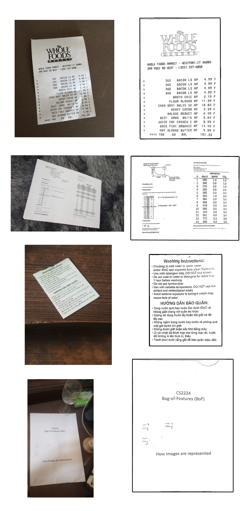

# document-scanner-app
We want to create an application that will help people scan documents via phone camera to make life easier.

To run the app:
- First install packages from the requirements
`pip install -r requirements.txt`
- Export flask api
`export FLASK_APP=main-api.py`
- Run flask
`flask run`
